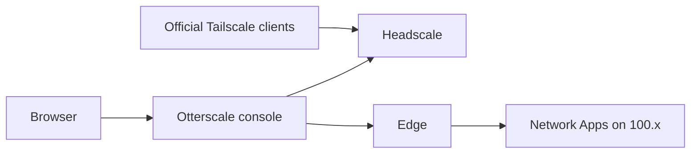

# Otterscale

Self-hosted team mesh control. No per-seat lock-in. A console on [Headscale](https://github.com/juanfont/headscale) for workspaces, tags, keys, and Network Apps — people join with **official Tailscale clients** only.

[](https://github.com/robosushie/otterscale/actions/workflows/ci-nextjs.yml)
[](https://github.com/robosushie/otterscale/actions/workflows/ci-go.yml)
[](https://github.com/robosushie/otterscale/actions/workflows/pages.yml)
[](./LICENSE)

[](https://nextjs.org/)
[](https://react.dev/)
[](https://www.prisma.io/)
[](https://www.typescriptlang.org/)
[](https://go.dev/)
[](https://pnpm.io/)
[](https://docs.docker.com/compose/)
[](https://github.com/juanfont/headscale)
[](https://authjs.dev/)
[](https://caddyserver.com/)
[](https://www.sqlite.org/)
[](https://github.com/robosushie/otterscale/pkgs/container/otterscale%2Fapp)

**Website:** [robosushie.github.io/otterscale](https://robosushie.github.io/otterscale/) — [features](https://robosushie.github.io/otterscale/features.html) · [deploy](https://robosushie.github.io/otterscale/deploy.html)

**Docs:** [docs/README.md](./docs/README.md) · [architecture](./docs/architecture.md) · [deployment](./docs/deployment.md) · [theme](./docs/theme.md)

## Features

- **No cap on users or devices.** Invite employees, freelancers, machines, and every server. Open source and self-hosted — no per-seat lock-in.
- **Workspaces and tags.** Workspaces decide who can access which resource. Tags give granular visibility and control. Give access controls to individual users.
- **Devices and apps, from anywhere.** Join once and reach allowed machines on the mesh. Publish a local app on `{subdomain}.{APPS_BASE_DOMAIN}` — HTTPS in front, traffic on `100.x`. This is not Funnel.
- **Official Tailscale clients only.** No custom VPN app. Add device prints `tailscale logout` then `tailscale up` pointed at your login-server.

## How it works

The browser talks to the Otterscale console. Official Tailscale clients talk to Headscale (the coordinator). Edge (Caddy TLS + Go tsnet) publishes Network Apps onto mesh IPs.



Roles are Owner, Super admin, Admin, and Member. Workspaces isolate peers. Tags are labels (`prod`, `uat`, `dev`). Local login and TOTP are always on; OIDC buttons appear when issuer, client id, and client secret are set.

## Stack

| Layer | Tools | Role |
|-------|--------|------|
| Console | Next.js 16, React 19, Tailwind v4 | App Router UI |
| Data | Prisma 6, SQLite | `DATABASE_URL` |
| Auth | Auth.js, Argon2, otpauth / TOTP, optional OIDC | Local login always on |
| Coordinator | Headscale 0.23 | Login-server, Noise, DERP map |
| Edge | Caddy, Go `cmd/proxy` (`tailscale.com` tsnet) | TLS + Network Apps hop |
| Clients | Official Tailscale apps | No custom VPN |
| Ship | Docker Compose, GHCR, GitHub Actions | Build, pull, Pages |
| Dev | pnpm 10, Node 22, TypeScript, ESLint, Vitest | CI Next.js |

## Quick start

Requires [Node.js 22](https://nodejs.org/), [pnpm 10.12.1](https://pnpm.io/), and an official [Tailscale client](https://tailscale.com/download) to join a device.

1. Copy env and set secrets:

   ```bash
   cp .env.example .env
   ```

   Required: `DATABASE_URL` (`file:./prisma/dev.db`), `AUTH_SECRET` (≥32 chars). Local auth is always on. Set `AUTH_OIDC_ISSUER`, `AUTH_OIDC_CLIENT_ID`, and `AUTH_OIDC_CLIENT_SECRET` to enable SSO buttons.

2. Apply migrations and run:

   ```bash
   pnpm db:migrate
   pnpm dev
   ```

3. Open `/setup`. Email, then username + password (min 8), then TOTP. The first account becomes Owner. Default tags: `prod`, `uat`, `dev`.

4. On **Add device** (`/machines`), run both printed commands. Login-server is `OTTERSCALE_DOMAIN`, or `http://127.0.0.1:8080` when that env is unset:

   ```bash
   tailscale logout
   tailscale up --login-server=http://127.0.0.1:8080 --auth-key=<key>
   ```

### Docker (build local)

Requires [Docker](https://docs.docker.com/get-docker/) and Compose.

```bash
pnpm deploy:stack
```

Creates or updates `.env` (generates `AUTH_SECRET`, sets SQLite `DATABASE_URL=file:/data/otterscale.db`), builds images, starts Headscale and `edge`, and writes `HEADSCALE_API_KEY` and `APPS_EDGE_AUTHKEY` after Headscale is healthy. The app container runs `prisma migrate deploy` before `node server.js`. Console: `https://console.localhost`.

If `*.localhost` does not resolve:

```text
127.0.0.1 console.localhost hs.localhost
```

To rotate the Headscale API key by hand:

```bash
docker exec headscale /ko-app/headscale apikeys create --expiration 8760h
```

Put the printed key in `.env` as `HEADSCALE_API_KEY`, then recreate the app container.

## Production (GHCR)

On a cloud VM or any Compose host, pull published images instead of building:

```bash
cp deploy/otterscale-stack.env.example .env
docker compose -f deploy/otterscale-stack.yaml --env-file .env up -d
```

Images: `ghcr.io/robosushie/otterscale/{app,edge,headscale}`. Default tag is `latest`. Semver tags from **Actions → Publish GHCR** also move `latest`. Set `OTTERSCALE_DOMAIN` and `AUTH_URL` in production. Bootstrap mints `HEADSCALE_API_KEY`, `APPS_EDGE_AUTHKEY`, and `AUTH_SECRET` (if empty) after Headscale is healthy.

If pulls return 401, open **Packages** for `app`, `edge`, and `headscale` and set visibility to public.

Platform notes (cloud VMs, Railway, Heroku): [deploy page](https://robosushie.github.io/otterscale/deploy.html).

## Configuration

Never commit `.env`. Copy from [`.env.example`](./.env.example).

| Variable | Required | Purpose |
|----------|----------|---------|
| `DATABASE_URL` | Yes | SQLite path (`file:./prisma/dev.db` locally; `file:/data/otterscale.db` in Docker) |
| `AUTH_SECRET` | Yes | Auth.js secret, ≥32 characters |
| `AUTH_URL` | Production | Public console origin (`https://console.localhost` locally) |
| `AUTH_OIDC_ISSUER` | Optional | OIDC issuer; SSO buttons stay off until all three OIDC vars are set |
| `AUTH_OIDC_CLIENT_ID` | Optional | OIDC client id |
| `AUTH_OIDC_CLIENT_SECRET` | Optional | OIDC client secret |
| `AUTH_SETUP_TOKEN` | Optional | Token required for first Owner signup on `/setup` |
| `HEADSCALE_INTERNAL_URL` | Docker | App → Headscale (`http://headscale:8080`) |
| `HEADSCALE_PUBLIC_URL` | Docker | Public Headscale URL |
| `HEADSCALE_API_KEY` | Docker | Filled by bootstrap / `deploy:stack` |
| `OTTERSCALE_DOMAIN` | Production | Login-server for Add device (HTTPS). Unset → `http://127.0.0.1:8080` |
| `APPS_EDGE_AUTHKEY` | Docker | Reusable `tag:edge` pre-auth key for the edge container |
| `APPS_BASE_DOMAIN` | Optional | Network Apps hostname suffix (default `apps.localhost`) |

## Development

Prereqs: Node 22, pnpm 10.12.1, [Go 1.25](./go.mod) (for `cmd/proxy`), Docker for the stack.

| Command | Purpose |
|---------|---------|
| `pnpm dev` | Next.js dev server |
| `pnpm lint` | ESLint |
| `pnpm test` | Vitest |
| `pnpm build` | `prisma generate` + `next build` |
| `pnpm db:make -- <name>` | New migration from schema (local; autogenerate only) |
| `pnpm db:migrate` | Apply pending migrations |
| `pnpm deploy:stack` | Build and run Docker stack |
| `docker compose -f deploy/otterscale-stack.yaml --env-file .env up -d` | Pull GHCR images |

After changing `prisma/schema.prisma`, run `pnpm db:make -- descriptive_name`. Never hand-edit `prisma/migrations/`.

UI follows [docs/theme.md](./docs/theme.md): parchment canvas, Newsreader weight 400, IBM Plex Mono, one Lake Blue primary CTA.

Commits use conventional types: `feat` · `fix` · `refactor` · `chore` · `docs` · `test` · `style`. Pull requests must pass **CI Next.js** and **CI Go**. Do not commit secrets.

Coding agents: [AGENTS.md](./AGENTS.md).

## Repo layout

| Path | Purpose |
|------|---------|
| `app/` | Next.js App Router |
| `components/` | UI |
| `lib/` | Server: auth, policy, Headscale adapter, Prisma |
| `cmd/proxy` | Go tsnet Network Apps hop (runs inside `edge`) |
| `internal/appsproxy/` | Go proxy internals |
| `prisma/` | Schema and migrations |
| `deploy/` | Compose, Caddy, Headscale, Dockerfiles, Otterscale Stack |
| `site/` | GitHub Pages marketing site |
| `docs/` | Architecture, roadmap, deployment, theme |
| `tests/` | Vitest |

## Documentation

| Document | Purpose |
|----------|---------|
| [docs/README.md](./docs/README.md) | Doc index |
| [Product overview](./docs/product-overview.md) | Vision, personas, scope |
| [Architecture](./docs/architecture.md) | Components, data model, flows |
| [Roadmap](./docs/roadmap.md) | Delivery plan |
| [Deployment](./docs/deployment.md) | Images, topologies, operations |
| [Security](./docs/security.md) | Threat model, controls, audit integrity |
| [Design theme](./docs/theme.md) | Console visual system |
| [Design spec PDF](./docs/external/Otterscale_Design_Architecture.pdf) | Source specification (draft v0.5) |

## Security

Treat the control plane like an identity provider: it decides who can reach what on the mesh. Details: [docs/security.md](./docs/security.md). Never commit `.env`, API keys, or pre-auth keys.

## License

[GNU General Public License v3.0](./LICENSE). You may run, study, and share Otterscale. If you distribute a modified version, you must also provide GPL-3.0 source. Selling is allowed; a closed-source fork is not.
