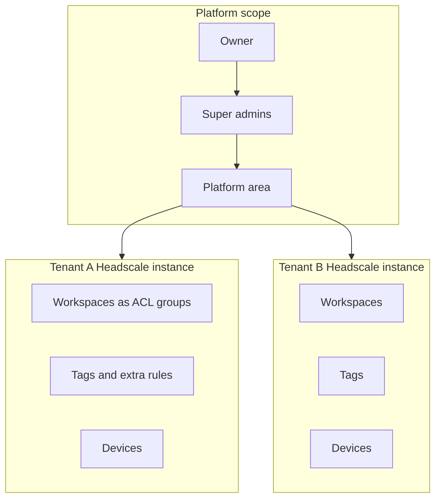

# Otterscale architecture

Otterscale is a **control platform** in front of **one Headscale instance per tenant**. All product logic (roles, audit, access requests, policy intent, analytics, orchestration) lives in Otterscale; Headscale remains the coordination engine for the official Tailscale protocol clients.

**Client decision:** Otterscale does **not** ship a custom VPN app. Users install the official Tailscale clients and point them at their tenant’s login server URL; the console **Connect** area and `otter` CLI guide onboarding.

Reference: [design specification PDF](./external/Otterscale_Design_Architecture.pdf) v0.5.

### Current implementation (Phase 1–2, single tenant)

The shipping control plane is a **Next.js 16** app with **Prisma 6** on SQLite (`DATABASE_URL`). One organisation, one Headscale instance (optional in dev), **workspaces as the isolation unit** (Headscale ACL groups), **tags** as orthogonal ACL labels, policy compiler, audit hash chain, and RBAC (**Owner / Super admin / Admin / Member**). Auth: **Auth.js** with **local credentials + TOTP always on**; generic OIDC enables automatically when issuer, client id, and client secret are all set. The console sidebar is Network (Machines, Apps), Users, Access controls (Workspaces, Policies), Audit (System / Network logs), and Settings (General, User management, Device management, Policy file, Keys). Prisma stores ACL **groups** as workspaces. **Network Apps** are published through one `proxy` container: a Go `tsnet` node (hostname `edge` / `tag:edge`) that reverse-proxies on `:80` and answers TCP probes on `:4180`. Public Caddy forwards `*.apps.localhost` to `proxy:80`. `headscale/headscale` is the coordination server. This is not Tailscale Funnel. Billing, Funnel, Mullvad, and Tailnet Lock are out of Phase 1–2. Multi-tenant orchestration (N Headscale processes) remains a later epic per [roadmap](./roadmap.md).

Code layout: `app/` (routes), `components/`, `lib/` (`headscale/` adapter only for Headscale HTTP), `cmd/proxy` (Go tsnet Network Apps hop), `internal/appsproxy/`, `prisma/`, `deploy/`.

---

## High-level topology

```mermaid
flowchart TB
  subgraph users [Users and devices]
    B[Browser console]
    TC[Official Tailscale clients]
  end

  subgraph edge [Edge]
    RP[Reverse proxy TLS and WebSockets]
  end

  subgraph platform [Otterscale platform stateless]
    API[API and authz]
    WRK[Worker scheduler reaper compiler jobs]
    ORCH[Orchestrator]
    WEB[Console static assets]
  end

  subgraph data [Control data]
    PG[(PostgreSQL)]
  end

  subgraph tenants [Per tenant]
    HS1[Headscale process 1]
    DB1[(SQLite plus Litestream)]
    HS2[Headscale process N]
    DBN[(SQLite plus Litestream)]
  end

  subgraph relay [Relay plane UDP]
    DERP[DERP and STUN fleet]
  end

  B --> RP
  TC --> RP
  TC --> DERP
  RP --> API
  RP --> WEB
  RP --> HS1
  RP --> HS2
  API --> PG
  WRK --> PG
  ORCH --> HS1
  ORCH --> HS2
  API --> HS1
  WRK --> HS1
  HS1 --> DB1
  HS2 --> DBN
  HS1 -.-> DERP
  HS2 -. DERP
```

**Teal (your code):** API, worker, orchestrator, console, policy compiler, audit, access workflows.  
**External engine:** Headscale per tenant.  
**Relay plane:** Shared DERP/STUN (VM with UDP); tenant Headscale instances disable embedded DERP in all-in-one mode to avoid port conflicts.

---

## Key design decisions

| # | Decision | Rationale |
|---|----------|-----------|
| 1 | Integrate via Headscale **API** (gRPC / REST v2), never shell CLI | Typed, testable, works across hosts |
| 2 | **Intent-based policy** in Postgres → compile to HuJSON | UI and humans edit intent; output deterministic and testable |
| 3 | **One Headscale instance per tenant** | Matches single-tailnet model; hard isolation |
| 4 | **Own DB** for roles, audit, requests, grants, analytics | Headscale holds network state, not product state |
| 5 | **Official Tailscale-protocol clients only** | No app-store or signing burden; compatibility moat |
| 6 | Poll Headscale + internal event bus → **SSE/WebSocket** to browser | No first-class Headscale event stream [verify] |
| 7 | Postgres platform DB; **SQLite per tenant** + backups | Aligns with Headscale guidance; shard blast radius |
| 8 | **Single console module**; API enforces all roles | Hidden nav is cosmetic |
| 9 | **Pluggable orchestrator:** process, docker, kubernetes | Same tenant model from homelab to SaaS |

---

## Component responsibilities

### API service

- OIDC for people; scoped API keys and machine credentials
- REST (+ optional gRPC) for tenants, policy, devices, access workflow, platform admin
- Server-side authorization on every request; roles from DB, not JWT claims alone
- Idempotency keys on mutating writes (design target)

### Worker / scheduler

- Policy compile-and-apply jobs (debounced)
- Grant **reaper** (expired access → recompile)
- Notification dispatch (email, chat webhooks)
- Headscale polling for device lifecycle → audit + events
- Postgres-backed queue (e.g. River) for small installs

### Policy compiler

Pipeline:

1. Load intent: workspaces (ACL groups), tags, extra rules, published-app destinations, active grants, share-link constraints
2. Lint (wildcards, empty groups, tag owners)
3. Emit HuJSON + generated `tests` block
4. Run Headscale policy check (adapter)
5. Store snapshot (hash, author, version id)
6. Apply to tenant Headscale; audit success/failure
7. Rollback = re-apply prior snapshot

See [roadmap Phase 1](./roadmap.md#phase-1--foundations--tenant-mvp) for compiler rules.

### Headscale adapter (`internal/headscale`)

- **Only package** that talks to Headscale
- Versioned against pinned Headscale; compatibility tests in CI
- Maps Otterscale concepts to API calls: users, machines, routes, policy, keys, tags

### Orchestrator (`internal/tenancy`)

| Driver | Tenant runtime | Best for |
|--------|----------------|----------|
| `process` | Child OS process in all-in-one container | Quickstart, homelab, single PaaS service |
| `docker` | One container per tenant | Medium VMs |
| `kubernetes` | StatefulSet (or Deployment) per tenant | Hosted multi-tenant scale |

Creating a tenant: allocate IP prefix, ports, data directory → render config → start process/container → register route on edge proxy → mark `active` or roll back.

### Console (`web/`)

- Single Next.js (or spec: React/SvelteKit) app served as static assets or SSR
- Areas: **Platform**, **Workspace**, **Network**, **Audit & analytics**, **My access**, **Connect**
- Real-time: SSE for approvals, device online, policy apply status
- Visual design: [theme.md](./theme.md) — tokens in `app/globals.css`, no scattered hex in components

### DERP / STUN

- Separate image or VM; UDP 3478 + TLS
- Platform publishes relay map URL to tenants
- PaaS without inbound UDP **cannot** host relays (Railway-class); use EC2/VM

### `otter` CLI / agent (Phase 4+)

- Wraps official `tailscaled` / Tailscale CLI flows
- Talks to Otterscale API for auth keys, requests, share links
- Agent: heartbeat, optional posture, optional flow sampling (opt-in)

### Kubernetes operator (Phase 5+)

- CRDs: `OtterService`, connectors/subnet routers
- Calls **Otterscale control API**, not Tailscale SaaS OAuth
- Mints scoped keys; tags nodes by environment

---

## Tenancy model



**Two usage profiles:**

1. **One organisation:** tenants as spaces (prod, uat, dev); super admins may have implicit tenant-admin on single-org installs.
2. **MSP / hosted:** tenant = customer org; super admin tenant access off by default; support sessions consented.

**Workspaces and tags:**

- **Workspace (isolation):** Headscale ACL group plus `tag:ws-{slug}` on member nodes. Same-workspace humans and nodes `accept *:*`. Owner and Super admin are implicit members of every workspace and see all machines.
- **Tags (labels):** org-scoped `tag:prod`, `tag:uat`, `tag:dev`, or custom. Orthogonal to isolation. `tagOwners` includes `tagged-devices` and platform admin emails so tagged auth keys work.
- **Strict isolation (later):** a dedicated Headscale instance, not a tag.

**Visibility:** Console machine list is filtered to workspaces the viewer belongs to (Owner/SA: all). Extra Policies rules are optional; default is workspace isolation.

**IP planning:** Non-overlapping CGNAT prefix per tenant instance (e.g. /20 each).

---

## Role model (summary)

| Role | Scope | Notes |
|------|-------|-------|
| Owner | Platform | Exactly one; immutable; all workspaces; adds super admins; platform settings |
| Super admin | Platform | All workspaces; limited platform (cannot add Owner) |
| Admin | Workspace | Manage that workspace, keys, devices, extra policy |
| Member | Workspace | See machines in workspaces they belong to |
| Guest | One device | Via share link (later) |

Platform actions that touch a tenant are mirrored into that tenant’s audit log.

Full matrix: [security.md](./security.md#authorization-matrix).

---

## Major flows

### First platform setup (Phase 2)

1. Install starts in **setup mode** (no Owner)
2. One-time token from host logs / env; short TTL
3. First login → Owner; MFA + recovery codes
4. Wizard: domain, SSO, relay map, email, default Headscale version
5. Setup mode permanently off; audited

### Device onboarding (human)

1. User opens **Connect** → install official app → tenant login URL
2. SSO via OIDC (device flow in browser)
3. Node registered in tenant Headscale; group from IdP or manual assignment
4. Policy compile includes user/group rules

### Device onboarding (server)

1. Tenant admin creates scoped auth key (env tag, reusable or ephemeral)
2. `otter up --authkey …` or `tailscale up --login-server … --authkey …`
3. Tagged node; visible per group rules

### Access request (Phase 3)

1. Member submits request (resource, duration, reason)
2. Approver(s) per env policy; no self-approval
3. On approve → grant row → compiler adds temporary ACL line
4. Reaper removes expired grants → recompile
5. All steps audited; notifications to chat/email

### Share link (Phase 3)

1. Member/admin creates link (device, ports, uses, expiry)
2. Guest redeems → ephemeral user/key + narrow rule + `tag:guest`
3. Revoke or expiry → reaper cleans node/policy

---

## Data model (control plane)

Core Postgres entities (conceptual):

- **Platform:** `owners`, `platform_admins`, `platform_settings`, `platform_audit`
- **Tenant:** `tenants` (state, prefix, headscale_version, orchestrator_ref), `tenant_members`, `tenant_roles`
- **Policy intent:** `groups`, `group_members`, `environments`, `access_rules`, `policy_snapshots`
- **Access:** `access_requests`, `access_grants`, `share_links`
- **Audit:** append-only `audit_events` with hash chain per tenant
- **Analytics:** aggregated tables / materialized views fed by workers

Headscale SQLite holds nodes, keys, routes, applied policy file—**not** Otterscale product roles.

---

## Technology stack (target)

| Layer | Choice | Notes |
|-------|--------|-------|
| Backend | Go | Same ecosystem as Headscale; static binaries |
| Control DB | PostgreSQL | JSONB for snapshots; row-level tenant scoping |
| Console | TypeScript, Next.js, Tailwind | [theme.md](./theme.md); Monaco policy editor; optional React Flow |
| Jobs | Postgres queue (River) or NATS | Prefer queue on Postgres for small installs |
| Metrics | Prometheus; optional ClickHouse | Headscale + platform metrics |
| Auth | OIDC; API keys; SCIM later | Step-up MFA for Platform area |
| Network client | Official Tailscale / tailscaled | Otterscale does not fork client core for v1 |

Current repo: Next.js scaffold for console shell; backend services to be added per [roadmap](./roadmap.md).

---

## Repository layout (target)

```
otterscale/
  cmd/           proxy (tsnet Network Apps hop); later platform, worker, orchestrator, otter, operator
  internal/
    appsproxy/   reverse proxy, probe, JSON route table
    headscale/   API adapter only
    policy/      compiler, linter, tests
    access/      requests, grants, share links, reaper
    audit/       append-only, hash chain, export
    tenancy/     orchestrator drivers
    platform/    setup, lifecycle, relays, upgrades
    authz/       RBAC checks + test fixtures
    analytics/
  web/           role-based console (may live at repo root app/ initially)
  connect/       Connect templates, MDM snippets
  sdk/           go, python, typescript, terraform-provider
  deploy/        compose, helm, caddy/nginx refs, derp
  docs/
  test/          Headscale + client version matrix
```

---

## Integration boundaries

| System | Otterscale uses it for | Otterscale does not |
|--------|------------------------|---------------------|
| Headscale | Nodes, policy file, keys, routes, DNS | RBAC, audit, approvals, multi-tenant UI |
| Official Tailscale client | Data plane, UX on device | Branding, in-app tenant list, in-app access requests |
| IdP (OIDC) | Human login, group claims | Device encryption keys |
| DERP relay | NAT traversal | Tenant policy |

Upgrade discipline: Headscale **strict minor upgrade path** — orchestrator upgrades canary tenant stepwise.

---

## Real-time and events

Until Headscale exposes events [verify]:

1. Workers poll Headscale API on interval + after mutating calls
2. Normalized events pushed to internal bus
3. API exposes `GET /v1/tenants/{t}/events` (SSE) for console

---

## Related documents

- [Deployment](./deployment.md) — images, Compose, all-in-one, PaaS limits
- [Security](./security.md)
- [Open questions](./open-questions.md)
